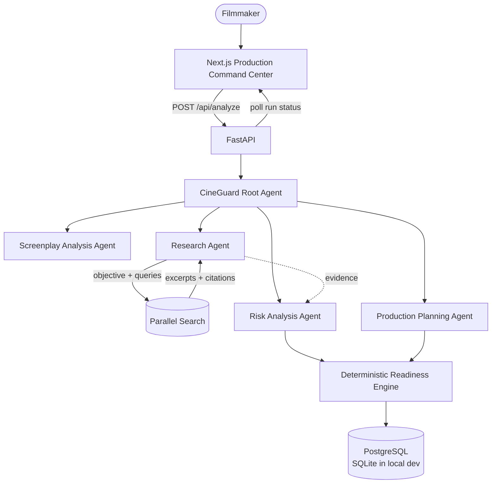

# CineGuard — architecture



## Component responsibilities (only what actually exists)

- **Gemini = understanding / reasoning.** Screenplay extraction and risk
  reasoning call Gemini (`google-genai`, API key or Vertex AI) with
  schema-constrained JSON output, validated with Pydantic. Malformed
  output is retried once, then raises a typed error — never fake data.
- **Parallel = external research.** The research planner turns production
  dependencies into bounded queries; `ParallelResearchProvider` calls
  `POST https://api.parallel.ai/v1/search` at runtime with retries, and
  every source keeps title / domain / URL / excerpt / timestamp.
- **Backend = deterministic scoring / state.** Readiness math, dedup,
  fix-plan projection, run lifecycle, retries — all reproducible, all
  tested without credentials.
- **PostgreSQL = persistent run / project state.** Projects → analysis
  runs → run events, with cascading deletes. Local dev runs the same
  schema on SQLite (`backend/migrations/001_init.sql` mirrors Postgres).

## Principles

## Principles

- Separate frontend/backend; typed JSON contract in `backend/app/models/schemas.py`.
- Agent logic as explicit ADK tools/workflows, not hidden prompts.
- **Separation of intelligence:** Gemini owns UNDERSTANDING / REASONING /
  CLASSIFICATION / RECOMMENDATIONS. The backend owns VALIDATION / STATE /
  SCORING / DETERMINISTIC CALCULATION / PERSISTENCE. Parallel owns LIVE
  EXTERNAL RESEARCH. This split keeps judging-relevant behavior reliable:
  scores and plans are reproducible, never model-invented.
- No hardcoded analysis in UI; frontend consumes API responses.
- Research without a key degrades honestly (`not_run`, zero sources) —
  citations are never fabricated.

## Request path (async, polled — no fake progress)

```
POST /api/analyze {screenplay_text, project_title?, project_id?}
 → 202 {run_id, project_id, status: "queued"} + background thread
 → stages persisted: queued → analyzing_screenplay → researching
   → reasoning_risks → building_plan → completed | failed
 → every stage + key operation appends a timestamped run_events row
GET /api/runs/{run_id}            # status + progress + events (+ result when done)
POST /api/runs/{run_id}/retry     # failed runs restart safely, same id
POST /api/plan {run_id, selected_recommendation_ids}
 → fixplan.build_fix_plan()       # deterministic mitigation math
GET /api/projects, GET /api/projects/{id}/runs, DELETE /api/projects/{id}
```

All errors share one envelope:
`{"error": {"code": "CODE", "message": "human text", "details": {}}}` —
never stack traces, never secrets. Failed runs persist stage + code +
message and stay retryable.

ADK agents (`app/agents/*`) wrap the same tools/services so Gemini
reasoning upgrades behavior without changing the pipeline shape.

## Evidence discipline

Every risk explains its support. `EvidenceItem.kind` is one of:
- `screenplay` — quoted/derivable from the uploaded text
- `research` — supplied Parallel evidence only (title/domain/url/excerpt)
- `inference` — production reasoning, labeled as such

UNKNOWN is never upgraded to fact; inference is never presented as confirmed.

## Readiness scoring methodology

`penalty(risk) = severity_weight × confidence_multiplier`; mitigated = 0.

```
score = clamp(100 − Σ penalties, 0, 100), 1 decimal
```

Defaults (`backend/app/config.py`, all configurable):
- weights: critical 15 / high 5 / medium 2 / low 0.5
- confidence: high ×1.0 / medium ×0.7 / low ×0.4
- status: READY ≥ 80 · AT RISK ≥ 60 · HIGH RISK ≥ 40 · else NOT READY

Same risks + config always yield the same score. The projected score in a
fix plan is this function re-run with selected risks marked mitigated.

## Run state & persistence

`app/db.py` is a zero-dependency SQLite store (WAL mode, per-operation
connections, `CINEGUARD_DB_PATH` override, per-test temp DBs):

- `projects(id, name, …)` — one row per production.
- `analysis_runs(id, project_id → CASCADE, status, current_stage,
  progress, screenplay_text, result_json, error_*, attempt, timestamps)`.
- `run_events(run_id → CASCADE, seq, ts, type, message, metadata_json)`.

Variable analysis artifacts (scenes/risks/evidence/…) stay one validated
JSON payload on the run row — relational tables would add joins without
query benefits at this scale. Deleting a project cascades runs + events
(tested — no orphans). Production Postgres DDL mirrors this schema in
`backend/migrations/001_init.sql`.
